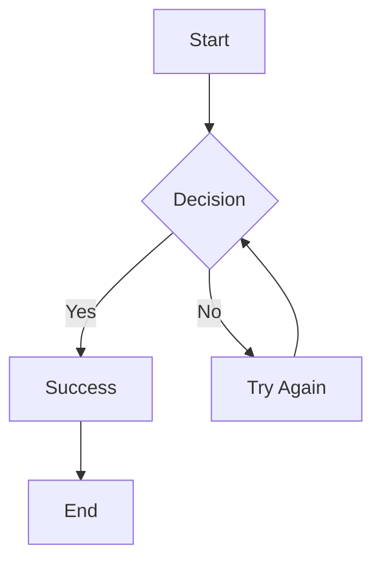

Here’s a complete Markdown document capturing the key content from the [Streamdown](https://streamdown.ai/) page:

```markdown
# Streamdown

A drop-in replacement for `react-markdown`, designed for AI-powered streaming.

## Installation

```bash
npx ai-elements@latest add response
# or
npm i streamdown
```

## Overview

Markdown is easy, but streaming it introduces challenges. Streamdown solves this by offering:

- Safe, well-formatted Markdown streaming
- Built-in support for AI Elements
- Standalone usage possible

## Usage Example

```tsx
'use client';
import { useChat } from '@ai-sdk/react';
import { useState } from 'react';
import { Response } from '@/components/ai-elements/response';

export default function Page() {
  const { messages, sendMessage, status } = useChat();
  const [input, setInput] = useState('');

  return (
    <>
      {messages.map(message => (
        <div key={message.id}>
          {message.parts
            .filter(part => part.type === 'text')
            .map((part, index) => (
              <Response isAnimating={status === 'streaming'} key={index}>
                {part.text}
              </Response>
            ))}
        </div>
      ))}
      <form
        onSubmit={e => {
          e.preventDefault();
          if (input.trim()) {
            sendMessage({ text: input });
            setInput('');
          }
        }}
      >
        <input
          value={input}
          onChange={e => setInput(e.target.value)}
          disabled={status !== 'ready'}
          placeholder="Say something..."
        />
        <button type="submit" disabled={status !== 'ready'}>
          Submit
        </button>
      </form>
    </>
  );
}
```

## Tailwind Integration

Update your `globals.css`:

```css
@source "../node_modules/streamdown/dist/index.js";
```

## Features

### ✅ GitHub Flavored Markdown

| Feature        | Standard MD | GFM |
|----------------|-------------|-----|
| Tables         | ❌          | ✅  |
| Task Lists     | ❌          | ✅  |
| Strikethrough  | ❌          | ✅  |

```markdown
- [x] Implement authentication
- [x] Add database models
- [ ] Write unit tests
- [ ] Deploy to production

~~Old approach~~ → New approach with AI models
```

### ✅ Code Blocks with Shiki

```tsx
import React from "react";

type ButtonProps = {
  label: string;
  onClick: () => void;
};

export const Button: React.FC<ButtonProps> = ({ label, onClick }) => (
  <button type="button" className="button" onClick={onClick} aria-label={label}>
    {label}
  </button>
);
```

### ✅ Math Support via KaTeX

Inline:

```latex
Euler's identity: $$e^{i\pi} + 1 = 0$$
```

Block:

```latex
$$
f(x) = \frac{1}{\sigma\sqrt{2\pi}} e^{-\frac{1}{2}\left(\frac{x-\mu}{\sigma}\right)^2}
$$
```

### ✅ Mermaid Diagrams



### ✅ Unterminated Markdown Blocks

Streamdown gracefully handles:

- `**bold text...`
- `_italic text...`
- `[link text...`
- `inline code...`

### ✅ Security Hardening

Blocks unsafe links and images to prevent prompt injection.

### ✅ Props

```ts
StreamdownProps {
  children: string;
  parseIncompleteMarkdown?: boolean;
  className?: string;
  components?: object;
  rehypePlugins?: array;
  remarkPlugins?: array;
  shikiTheme?: [BundledTheme, BundledTheme];
  mermaidConfig?: MermaidConfig;
  controls?: boolean | { table?: boolean, code?: boolean, mermaid?: boolean };
  isAnimating?: boolean;
}
```

## FAQ

- What makes Streamdown different from `react-markdown`?
- Can I use custom components?
- How does incomplete markdown parsing work?
- Is it compatible with all plugins?
- How do I configure Tailwind CSS?

---

Made with 🖤 and 🤖 by Vercel. [View the source code](https://streamdown.ai/).
```

Let me know if you'd like this broken into modular sections or adapted for a specific use case like documentation, onboarding, or a README.